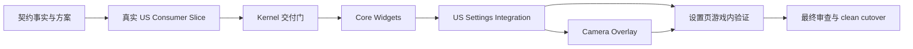

# FerriteLib.UiKit 重建：执行 DAG 与代理地图

> 本文件保留原始 lane ownership 作为背景。当前执行顺序以 `07-rebuild-reset-and-execution-contract-zh.md` 和 `tasks/MAIN-ORCHESTRATOR.md` 为准；第一轮实现已经证明，孤立 Kernel fixture 不能作为 P1 完成证据。

## 当前裁决

真实消费者门（Gate R）位于 Kernel fixture 与 Core Widgets/US 全量迁移之间。任何没有真实 US resource、真实 settings binding 和生产 Host 调用方的实现，都只能算 isolated slice。

## 1. 总体 DAG



**硬依赖：** Gate R 之前不得全量迁移 US；Gate U 之前不得 clean cutover；stub/build 证据与游戏内证据必须分开。

## 2. 当前执行阶段与门禁

本节替代本文件原先把 Kernel fixture 直接连接到 Core Widgets 的执行顺序。旧 lane ownership 仍可参考，但不得跳过真实消费者门。

### R0 — 契约事实与目标冻结（串行）

主代理必须先产出：实际生产调用图、目标调用图、真实 US slice 选择、binding/action 类型所有权、尺寸/比例/viewport 语义，以及自动证据与游戏内证据的边界。

R0 禁止全量 US 迁移、删除旧路径或以测试通过代替方案裁决。

### R1 — 真实 US Consumer Slice（串行）

任务书：`tasks/DEEPSEEK-KERNEL-DELIVERY.md`、`tasks/DEEPSEEK-REAL-CONSUMER-SLICE.md`。

目标：至少一条真实 US resource → Kernel manifest/registry → 真实 settings binding/action → Settings Window-owned Host → 每帧 IMGUI 生命周期 → 关闭/重开 session → focused regression 完整成立。

Gate R 必须确认：新 Host 有生产 caller；真实资源可创建；Kind、属性和 binding 在创建期验证；布局 Rect/坐标可解释；关键失败可 fallback；session 关闭后清理。Gate R 未通过，不得进入完整 Settings 迁移。

### K1 — Kernel 交付修正（可按 ownership 并行，门禁串行收口）

允许按旧 Lane A/B/C/D 分工实现，但所有改动必须服务 Gate R/K1：

- session/native：单一原生事件权威、session 隔离、结构与输入清理；
- schema/layout：属性验证、fixed/auto/weight 语义、viewport/content 分离、snapshot/cache；
- registry/contract：显式注册、重复定义诊断、统一 binding/action 规则；
- core widgets/theme：真实 Draw/Measure、关键控件 fallback、chart 原生拖拽与 GUI 状态恢复。

K1 不是“所有文件都有实现”，而是“真实 US slice 的所有跨边界假设均有证据”。

### U1 — US Settings Integration（串行、单 owner）

任务书：`tasks/DEEPSEEK-US-SETTINGS-MIGRATION.md`。

仅在 Gate R 通过后启动。目标是完整 Basic/Tuning/Packs 单一 Settings Host；动态列表保留 C# composite；业务真相保留在 US；新路径不再依赖旧 deferred dispatch、二次命令桥或进程级 UI 状态。

Gate U 必须覆盖完整 Schema2 Host creation、所有 US Kind/binding/action、三分区业务路径、低分辨率与多分辨率、popup/scroll/chart/filter/fallback，以及自动和游戏内证据。

### O1 — Overlay 第二宿主（串行）

只有 Gate U 通过后执行 `tasks/AGENT-OVERLAY.md`。Overlay 必须独立拥有 session，不依赖 Settings Window，不扩展成通用 HUD 管理器。

### C1 — 最终审查与 clean cutover（串行）

使用 `tasks/DEEPSEEK-GATE-REVIEW.md`。只有设置页、Overlay、自动门禁和真实游戏内证据均成立，才删除旧页面、旧事件队列、重复状态、命令桥和视觉 shim；否则保留明确 fallback 并记录唯一下一步。

## 3. 不能并行的边界

- Gate R 所需的真实 Host caller、完整资源、公共 binding/action 语义和 Settings Window session 生命周期。
- `LayoutManifest` 属性语义与 `WidgetRegistry.Resolve` 的 kind 语义。
- `UiSession` 与所有 native input/fallback 使用点。
- `IUiWidget` 与所有 core/US widget 实现。
- `Width` 的 fixed/weight 解释、Scroll viewport/content 和坐标转换。
- `Palette`、`SurfaceFrame`、`SelectionButton` 的唯一皮肤入口。
- US `VoicePacksPageModel`、布局资源和 composite widgets 的业务所有权。
- 同一个 RimWorld/Unity 原生方法的 Harmony patch。
- 同一测试入口、编译命令和游戏验证场景。

## 4. 代理通信与变更请求

- 主代理是集成 owner，负责 Gate R/U/O/C 的裁决和证据。
- 执行者只接受目标、边界、证据和停止条件，不接受逐行组装说明。
- DeepSeek 可以改变类名、文件拆分、算法和局部迁移顺序，但必须说明契约取舍和受影响消费者。
- 发现公共契约歧义、生产 caller 缺失、fallback 清理不成立或只能依赖 stub 时，停止扩大范围并报告事实、影响、替代方案和验证方式。
- 默认跳过 formatter、lint、全局 build、完整测试；主代理在 gate 统一收口，执行者只做必要 focused check。
- 不配置 remote、不 push、不发布。

## 5. 统一回报格式

每个阶段只提交以下信息：

```text
Goal:
Production call graph:
Contract decisions:
Evidence:
Result: PASS / LIMITED / FAIL
What remains unproven:
Blocking finding:
Next smallest action:
```

`PASS` 只表示对应 gate 的范围通过；没有真实 RimWorld 条件时，游戏内部分必须标记为 `LIMITED`。
